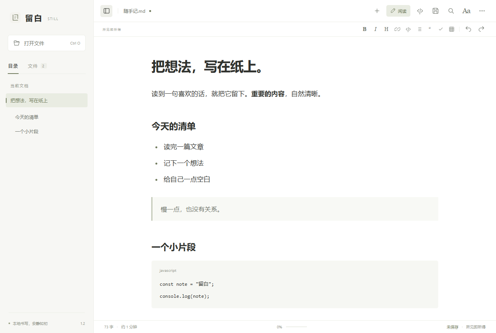

# Still · 留白

轻巧、安静的 Markdown 编辑器与阅读器。直接在排版后的正文中书写，保存为普通 Markdown 文件。

[English](README.en.md) · [发行页](https://github.com/kyanray-dev/still/releases/latest) · [许可证](LICENSE)



Still 使用系统 WebView，不捆绑整套浏览器。无需账户，文档在本机处理；应用不上传文档内容。当前版本为 **1.2.0**。

## 使用

| 平台 | 系统要求 | 打开方式 |
| --- | --- | --- |
| Windows x64 | Windows 10 / 11，Microsoft Edge WebView2 Runtime | 完整解压 `Still-1.2.0-Windows-x64.zip`，打开 `Still.exe`，保留同目录的 `resources.neu` |
| macOS universal | macOS 13+，Safari / 系统 WebKit 16.4+；Apple Silicon 或 Intel | 解压 `Still-1.2.0-macOS-universal.zip`，将 `留白.app` 拖入「应用程序」 |

发行包及校验值请以[发行页](https://github.com/kyanray-dev/still/releases/latest)实际提供的文件为准，也可按下方步骤自行构建。macOS 请保持系统与 Safari 更新；WebKit 最低要求涉及编辑器使用的[正则表达式支持](https://webkit.org/blog/13966/webkit-features-in-safari-16-4/)。

**当前打包产物未签名，macOS 包未经 Apple 公证，也尚未在 Mac 真机运行验证。** 已在 Windows 运行原生 WebView2 及 Chromium/WebKit 界面测试；GitHub macOS 测试机已通过 86 项单元测试、42 项 WebKit 界面测试及构建打包，尚未验证 macOS 原生应用交互。若系统阻止运行，请先确认下载来源，再使用系统提供的允许方式打开。

## 一张可以直接书写的纸

点击「编辑」，即可在同一张正文画布里修改标题、段落、引用、列表和表格。新建文档默认进入可视编辑，没有左右分栏。

- 行首输入 `# `、`## `、`- `、`1. ` 或 `> `，自动变成对应格式。
- 选中文字使用格式栏或快捷键，设置加粗、斜体、链接与代码。
- 表格单元格可以直接修改，Tab 移至下一格；任务列表可以直接勾选。
- 公式或特殊片段提供原位置的「编辑」入口，修改实时进入草稿，点击「完成」收起原文。
- 顶部 `</>` 在可视编辑与源码编辑之间切换；「更多 → 查看源文」用于只读检查。

同时提供多文档、拖入打开、自动目录、阅读进度、文内搜索、明亮/纸色/深色主题、系统外观、字号与版心设置。支持代码高亮与复制、数学公式、脚注、表格，以及自包含 HTML 导出和系统打印/PDF。

可视编辑保留 Markdown 内容与结构，修改后保存可能规范化空行、列表符号或引用链接等语法。需要精确保留原始标记时，请使用源码编辑。两个编辑模式各自保留撤销历史：仅切换模式不会清空历史；在另一模式修改内容后，返回时会载入新内容并开始新的撤销历史。不同文档的草稿、撤销历史与选区相互独立。

## 保存与草稿

- **修改不会自动写入磁盘。** 点击保存或使用快捷键才会写入；切换文档会保留内存中的草稿。
- 关闭、重新读取未保存文档或关闭窗口时会提示保存。保存前发现文件被其他程序修改，会询问另存为、覆盖或取消。
- 桌面版在原目录写入临时文件、读回校验，再替换目标文件。保存编码统一为 UTF-8，编辑器内换行统一为 LF。
- 不提供后台自动恢复。强制结束、断电可能丢失未保存草稿；macOS Dock「退出」等系统终止路径可能绕过窗口关闭提示，退出前请先保存。
- 浏览器开发预览通过下载 `.md` 保存，状态显示「已下载」，不会覆盖之前选择的本地原文件。

## 快捷键

| 操作 | Windows | macOS |
| --- | --- | --- |
| 打开 / 新建 | Ctrl + O / N | ⌘ + O / N |
| 编辑 / 阅读 | Ctrl + E | ⌘ + E |
| 保存 / 另存为 | Ctrl + S / Ctrl + Shift + S | ⌘ + S / ⌘ + Shift + S |
| 撤销 / 重做 | Ctrl + Z / Ctrl + Shift + Z | ⌘ + Z / ⌘ + Shift + Z |
| 加粗 / 斜体 / 链接 | Ctrl + B / I / K | ⌘ + B / I / K |
| 文内查找 | Ctrl + F | ⌘ + F |
| 上 / 下一个搜索结果 | Shift + Enter / Enter | Shift + Enter / Enter |
| 切换侧栏 | Ctrl + \ | ⌘ + \ |
| 只读源文 / 阅读 | Ctrl + Shift + M | ⌘ + Shift + M |
| 打印 | Ctrl + P | ⌘ + P |
| 关闭搜索或设置 | Esc | Esc |

## 文件与隐私边界

支持 `.md`、`.markdown`、`.mdown`、`.mkd`、`.txt`，UTF-8 及带 BOM 的 UTF-16。单个文档或本地图片上限为 10 MiB；不支持的编码会提示转存 UTF-8。

桌面版支持文档同目录及子目录中的相对 PNG、JPEG、GIF、WebP、BMP 图片，以及相对 Markdown 文档链接。不加载本地 SVG、绝对路径或越过父目录的图片；符号链接跟随系统解析，因此路径检查不构成操作系统沙箱。浏览器开发预览受文件权限约束，不能读取相邻图片。

本地文件可离线使用；在线 HTTPS 图片需要网络，并会向图片来源发起请求。导出的 HTML 内嵌已解析的本地图片和公式字体，远程图片仍可能需要网络。

原始 HTML、脚本和 Mermaid 图表不会执行，Markdown 渲染经过清洗。复杂片段保留原文，可继续编辑；数学、脚注、表格和任务状态支持可视编辑后的 Markdown 往返。

搜索按显示文本匹配，支持跨行内格式，不跨段落，也不搜索公式内部标记；最多高亮 5,000 个结果。最近文件路径和阅读设置保存在本机，清除最近记录不会删除文件。

## 开发与构建

建议使用 Node.js **22.22.2+（22.x）或 24.15+（24.x）**，依赖锁定在 `package-lock.json`。

```sh
npm ci
npm run dev
```

打开终端给出的本机地址。桌面调试需先下载桌面运行时并构建资源：

```sh
npm run native:update
npm run build:web
npm run native:run
```

生成发布包：

```sh
npm run native:update
npm run build
npm run package
```

`release/` 输出 Windows x64、macOS universal ZIP 与 SHA-256 校验值。`bin/`、`dist-web/`、`dist-native/` 是生成目录。源码包含图标与生成脚本，常规构建无需额外图形依赖。

## 测试

```sh
npm test
npx playwright install chromium webkit
npm run test:e2e
```

Windows 本地默认使用已安装的 Edge；设置 `PLAYWRIGHT_CHANNEL=chromium` 可选择 Playwright Chromium。设置 `PLAYWRIGHT_BROWSER=webkit` 运行 WebKit 套件；PowerShell 对应 `$env:PLAYWRIGHT_BROWSER='webkit'`。

构建后，在 Windows 运行原生集成测试：

```sh
node scripts/test-native.mjs
```

测试启动真实的隐藏桌面窗口，通过 WebView2 验证界面和文件保存。原生拖入使用框架事件模拟，中文组合输入使用自动化事件；系统输入法、系统文件选择器手势、打印对话框和 Mac 真机操作不属于已完成的自动化验证。样例在专用数据目录创建，测试结束后恢复原有设置与最近记录。

[构建工作流](.github/workflows/build.yml)包含 Windows/macOS 构建与测试配置；远程执行状态以仓库 Actions 记录为准。

当前已知验证限制：[Windows 云端原生检查](https://github.com/kyanray-dev/still/actions/runs/37602324943)连接桌面调试端点超时，尚未通过；同一运行中的单元测试、浏览器界面测试及构建已通过。本机 Windows 的 21 项真实 WebView2 检查已通过。云端超时的具体原因仍未确定，未跳过失败检查或将其标为成功。

## 实现与许可

TypeScript、Vite 与 [Neutralinojs](https://neutralino.js.org/docs/)。可视编辑使用 ProseMirror，源码编辑使用 CodeMirror 6；Markdown 由 markdown-it 解析、DOMPurify 清洗，highlight.js 和 KaTeX 分别处理代码与公式。界面使用系统字体和自制 SVG 图标。

本项目的**原创代码采用 [0BSD 许可证](LICENSE)**。第三方组件、运行时及字体保留各自的许可证，不因本项目采用 0BSD 而变更；详见 [THIRD-PARTY-NOTICES.txt](THIRD-PARTY-NOTICES.txt) 与 [licenses/](licenses/)。
